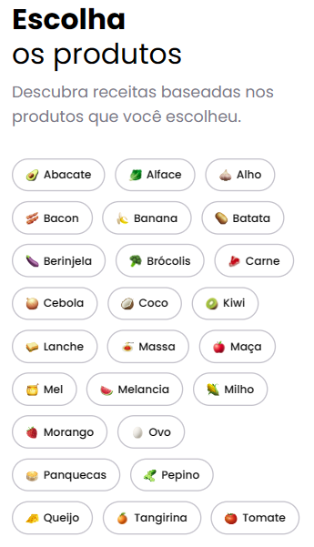
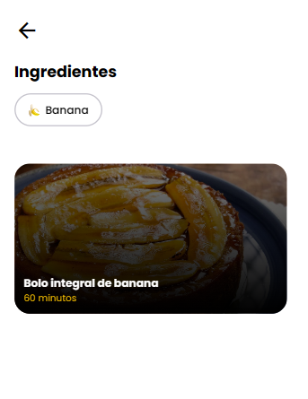
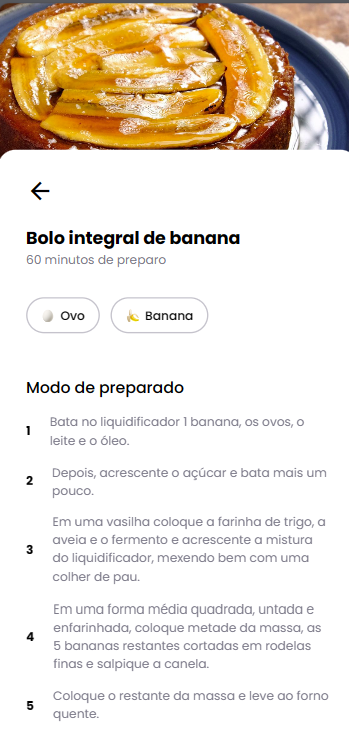

#Cook

**Discover recipes based on the ingredients you have at home!**

## Getting Started

1. **Clone the repository:**

   ```bash
   git clone https://github.com/drianodev/cook-react-native.git
   ```

2. **Install dependencies:**

   ```bash
   cd cook
   npx install
   ```

3. **Start the development server:**

   ```bash
   npx expo start
   ```

4. **Scan the QR code with the Expo Go app or visit ``http://localhost:8081/``.**

## Features

- **Ingredient selection:** Choose ingredients to find matching recipes.
- **Recipe search:** Explore recipes based on your selected ingredients.
- **Recipe details:** View full recipe details, including ingredients, instructions, and preparation time.
- **Image display:** See a preview of each recipe with its image.

## Technologies

- **React Native:** Cross-platform mobile app development framework.
- **Expo:** Toolset for building and deploying React Native apps.
- **TypeScript:** Superset of JavaScript with type safety.
- **Supabase:** Open-source backend-as-a-service for storing recipes and ingredients.

## Demo

| Image 1 | Image 2 | Image 3 |
|---|---|---|
|  |  |  |
